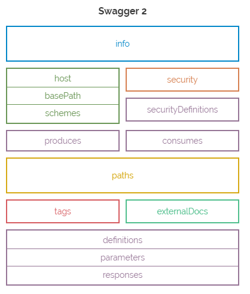
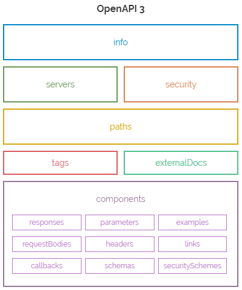

> 转载：[Swagger 2 与 OpenAPI - miku 设定 - 简书](https://www.jianshu.com/p/879baf1cff07)

### 重命名

swagger: 2.0
openAPI: 3.0.0

```yaml
openapi: 3.0.0
info:
  title: Sample API
  description: Optional multiline or single-line description.
  version: 0.1.9
```





---

### 网址结构

Swagger 2.0 基础 URL 结构

```yaml
info:
  title: Swagger Sample App
  host: example.com
  basePath: /v1
  schemes: ["http", "https"]
```

OpenAPI 3.0 基础 URL 结构

```yaml
 servers:
 - url: https://{subdomain}.site.com/{version}
   description: The main prod server
     variables:
       subdomain:
         default: production
       version:
         enum:
           - v1
           - v2
         default: v2
```

我们可以定义一个基础 url，通过{}里面装载变量值（类似于路径模版），在使用时，通过 variables 属性可以定义变量值，当然也可以给定默认值

---

### 组件

Swagger 2 中的 definitions 概念在 OpenAPI 3 中标准化为【组件】，可以在多个地方重复使用且可定义，组件列表如下：

- 响应 responses （已存在）
- 参数 parameters （已存在）
- 示例 examples （新）
- 请求体 requestBodies（新）
- 标题 headers （新）
- 链接 links （新）
- 回调 callbacks （新）
- 模式 schemas （更新）
- 安全体系 securitySchemes（更新）

---

### 请求格式

Swagger 2

```yaml
/pets/{petId}:
  post:
    parameters:
      - name: petId
        in: path
        description: ID of pet to update
        required: true
        type: string
      - name: user
        in: body
        description: user to add to the system
        required: true
        schema:
          type: array
          items:
            type: string
```

Swagger 2 最容易混淆的方面之一是 body / formData。它们是参数的子集，只能有一个或另一个，如果你使用 body，格式与参数的其余部分不同（只能使用 body 参数，名称不相关，格式不同，等等） ???

OpenAPI 3

```yaml
/pets/{petId}:
  post:
    requestBody:
      description: user to add to the system
      required: true
      content:
        application/json:
          schema:
            type: array
            items:
              $ref: "#/components/schemas/Pet"
          examples:
            - name: Fluffy
              petType: Cat
            - http://example.com/pet.json
    parameters:
      - name: petId
        in: path
        description: ID of pet to update
        required: true
        type: string
```

现在，body 已经被移入了它自己的叫做 requestBody 的部分，并且 formData 也已经被合并到里面。另外，cookies 已经被添加为参数类型（除了现有的标题，路径和查询选项之外）。

requestBody 有很多新的功能。现在可以提供 example（或数组 examples）for requestBody。这是非常灵活的（你可以传入一个完整的例子，一个参考，甚至是一个 URL 的例子）。

新的 requestBody 支持不同的媒体类型（content 是一个 MIME_Types 的数组，像 application/json 或者 text/plain，当然你也可以用*/*捕捉所有）。

对于参数，你有两个选择你想如何定义它们。你可以定义一个“模式”（像原来 2.0 那样），可以尽情地描述项目。如果更复杂，可以使用“requestBody”中的“content”。

---

### 响应格式

通配符的出现，我们可以以“4XX”来定义响应，而不必单独定义每个响应码。
响应和响应头可以更复杂。可以使用“content”对象（如在请求中）的有效载荷。

### 回调概念

```yaml
myWebhook:
  "$request.body#/url":
    post:
      requestBody:
        description: Callback payload
      content:
        "application/json":
          schema:
            $ref: "#/components/schemas/SomePayload"
          responses:
            200:
              description: webhook processed!
```

---

### 链接

链接是 OpenAPI 3 最有趣的补充之一。它有点复杂，但可能非常强大。这基本上是描述“下一步是什么”的一种方式。

比方说，你得到一个用户，它有一个 addressId。这 addressId 本身是无用的。您可以使用链接来展示如何“扩大”，并获得完整的地址。

```yaml
paths:
  /users/{userId}:
    get:
      responses:
        200:
          links:
            address:
              operationId: getAddressWithAddressId
              parameters:
                addressId: "$response.body#/addressId"
```

在“/ users / {userId}”的响应中，我们找回了一个 addressId。“链接”描述了如何通过引用“\$ response.body＃/ addressId”来获取地址。

另一个用例是分页。如果要获取 100 个结果，links 可以显示如何获得结果 101-200。它是灵活的，这意味着它可以处理任何分页方案 limits 来 cursors。

---

### 安全

Swagger 2

```yaml
securityDefinitions:
  UserSecurity:
    type: basic
  APIKey:
    type: apiKey
    name: Authorization
    in: header
security:
  - UserSecurity: []
  - APIKey: []
```

OpeanAPI 3

```yaml
components:
  securitySchemes:
    UserSecurity:
      type: http
      scheme: basic
    APIKey:
      type: http
      scheme: bearer
      bearerFormat: TOKEN
security:
  - UserSecurity: []
  - APIKey: []
```

一堆安全性的变化！它已被重命名，OAuth2 流名已更新，您可以有多个流，并且支持 OpenID Connect。“基本”类型已被重命名为“http”，现在安全可以有一个“方案”和“bearerFormat”。
